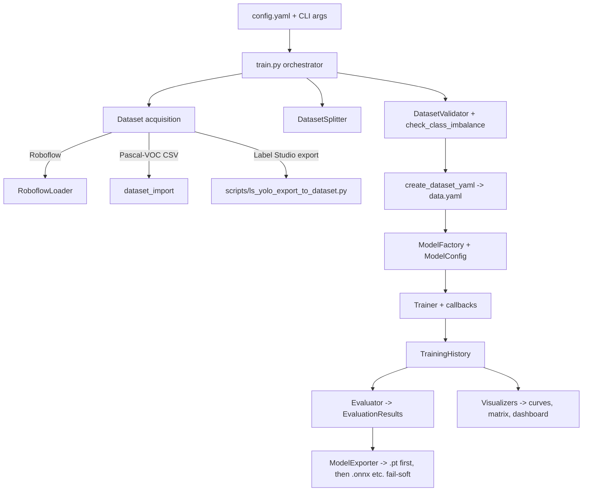

# Architecture

`screencropnet_yolo` is a thin, opinionated layer over Ultralytics YOLO 26. Each
pipeline stage lives in its own module with config dataclasses and plain
functions; `train.py` is the orchestrator that wires them together.

The package uses a src-layout (`src/screencropnet_yolo/`), hatchling builds, and
dynamic versioning from git tags via `uv-dynamic-versioning`.

## Pipeline flow



## Modules

| Module | Responsibility | Key public API |
|--------|----------------|----------------|
| `train.py` | CLI entry point; orchestrates the whole run and logs to a timestamped file under the output dir | `main`, `parse_args`, `load_config`, `train_model`, `evaluate_model`, `export_model` |
| `dataset_utils.py` | Dataset acquisition, validation, splitting, `data.yaml` generation, Twitter-specific preprocessing | `RoboflowLoader`, `DatasetSplitter`, `DatasetValidator`, `TwitterScreenshotPreprocessor`, `create_dataset_yaml`, `check_class_imbalance`, `display_dataset_stats` |
| `dataset_import.py` | Convert Pascal-VOC CSV annotations into a single-class YOLO dataset | `prepare_twitter_dataset`, `convert_csv`, `pascal_row_to_yolo` |
| `model.py` | Wraps Ultralytics `YOLO`; centralizes hyperparameters, device selection, multi-GPU, augmentation presets, export, and quantization | `ModelConfig`, `AugmentationConfig`, `ModelFactory`, `ModelExporter`, `ModelQuantizer`, `get_model_info`, `compare_models` |
| `training.py` | Training loop, metrics history, and a callback system (early stopping, checkpoints, TensorBoard, W&B) | `Trainer`, `TrainingHistory`, `TrainingMetrics`, callback classes, `create_ablation_study` |
| `evaluation.py` | Metrics on val/test splits and analysis helpers | `Evaluator`, `EvaluationResults`, `ClassMetrics`, `calculate_iou`, `find_optimal_confidence`, `benchmark_model` |
| `inference.py` | Runtime prediction on images, batches, and video, plus result export | `InferencePipeline`, `InferenceResult`, `Detection`, `ResultExporter`, `apply_nms` |
| `demo.py` | `screencrop-demo` CLI: async inference on a random image sample into a contact-sheet montage; `fzf` model picker (`--select`) via `pyfzf` | `main`, `run_demo`, `annotate_one`, `resolve_model`, `discover_models`, `select_model`, `build_contact_sheet` |
| `visualization.py` | Matplotlib/seaborn plot helpers used by training and evaluation | `TrainingVisualizer`, `ConfusionMatrixVisualizer`, `DetectionVisualizer`, `DatasetVisualizer`, `ResultsDashboard` |
| `output.py` | Pure presentation helpers for the CLI (run banner, artifacts table, byte/color formatting); no Ultralytics/torch imports, raw ANSI instead of `rich` | `format_run_summary`, `format_artifacts_table`, `human_size`, `colorize`, `Color`, `Artifact`, `ColorFormatter` |
| `config/config.yaml` | Default training configuration consumed by `train.py --config` | — |

## Configuration model

The pipeline reads a single YAML config (see
[configuration.md](configuration.md)). At runtime, `merge_config_with_args`
overlays CLI flags (`--data`, `--epochs`, `--batch`, `--imgsz`, `--device`,
`--workers`, `--output`, `--model-size`) on top of the file, so the YAML is the
baseline and flags are targeted overrides.

`model.py` then translates the relevant slices of that dict into typed
dataclasses (`ModelConfig`, `AugmentationConfig`) before handing arguments to
Ultralytics. This keeps Ultralytics' large keyword surface in one place.

## Callbacks

`Trainer` owns a list of `TrainingCallback`s. By default it wires up metrics
logging, early stopping, checkpointing, and (when enabled in config) TensorBoard
and Weights & Biases. Add your own with `Trainer.add_callback(...)` before
calling `train()`.

## Console output

`output.py` keeps all user-facing formatting separate from the training path.
`main` prints a `RUN CONFIGURATION` banner (resolved device, epochs, dataset,
output/weights dirs, export formats) before training and an `ARTIFACTS` table
(paths, human-readable sizes, best epoch/mAP) after export. Color is opt-in via
`--color` and auto-disabled when stdout is not a TTY or `NO_COLOR` is set; the
file log stays plain. During training the metrics logger renders `Epoch N/TOTAL`
and the post-training validation pass is labeled `(final val)`.

Export is ordered: the `pytorch` format runs first and copies the real
`train/weights/best.pt` (threaded in via `ModelExporter(source_weights=...)`);
any other format that fails logs a warning and is skipped rather than aborting
the run.

## Output layout

A run writes everything under `logging.output_dir` (default
`./runs/twitter_detect`):

```
runs/twitter_detect/
├── training_YYYYMMDD_HHMMSS.log
├── dataset.yaml
├── train/weights/{best,last}.pt
├── evaluation_results.json
└── visualizations/
    ├── training_curves.png
    ├── loss_components.png
    ├── confusion_matrix.png
    └── results_dashboard.png
```

## External dependencies

`ultralytics` (YOLO 26), `torch`, `opencv-python`, `pyyaml`, `matplotlib` /
`seaborn` (plots), `wandb` (experiment tracking), and `albumentationsx`
(augmentation, dev-only).
