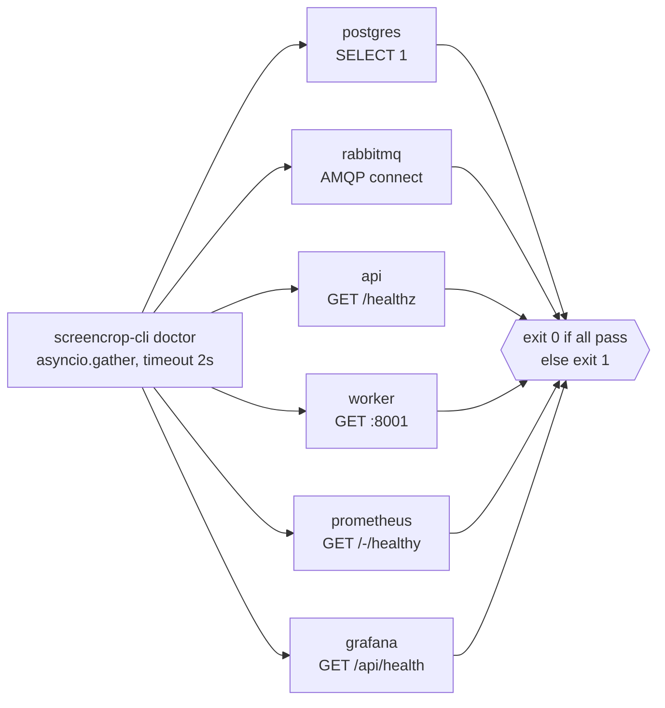

# `screencrop-cli doctor`

Concurrent health check for the whole ingest/classify stack. Every service is
probed at once (`asyncio.gather`) with a per-probe timeout, so one hung service
never blocks the rest and the sweep finishes in roughly `doctor_timeout` seconds.

```bash
uv run screencrop-cli doctor          # rich table of ✔︎/✘ + latency
uv run screencrop-cli doctor --json   # machine-readable JSON
make doctor                           # same as the plain command
```

## What it checks



| Service     | Probe                                                        |
| ----------- | ----------------------------------------------------------- |
| postgres    | async `SELECT 1` over `postgres_dsn`                        |
| rabbitmq    | open + close an AMQP connection to `rabbit_url`             |
| api         | `GET /healthz`, expecting `{"ok": true}`                    |
| worker      | `GET` the worker metrics port (`worker_metrics_url`)        |
| prometheus  | `GET prometheus_url` (`/-/healthy`)                         |
| grafana     | `GET grafana_url` (`/api/health`)                           |

Targets and the timeout come from `Settings` and are overridable via
`SCREENCROPNET_*` env vars (e.g. `SCREENCROPNET_PROMETHEUS_URL`,
`SCREENCROPNET_DOCTOR_TIMEOUT`). Host ports mirror `docker-compose.yml`
(prometheus `9091`, grafana `3001`).

## Exit code

`doctor` exits `0` only when **every** check passes, and `1` if any check fails
or times out — so it drops straight into CI or a shell `&&` chain:

```bash
uv run screencrop-cli doctor && uv run screencrop-cli submit ./shots
```

## Typical setup

```bash
make services-up        # postgres, rabbitmq, prometheus, grafana
make api                # in another shell
make worker             # in another shell
uv run screencrop-cli doctor
```

For the full stack bring-up in context, see
[running-the-classifier-service.md](running-the-classifier-service.md).
