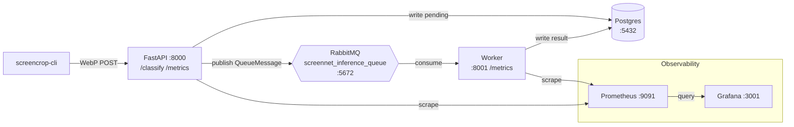
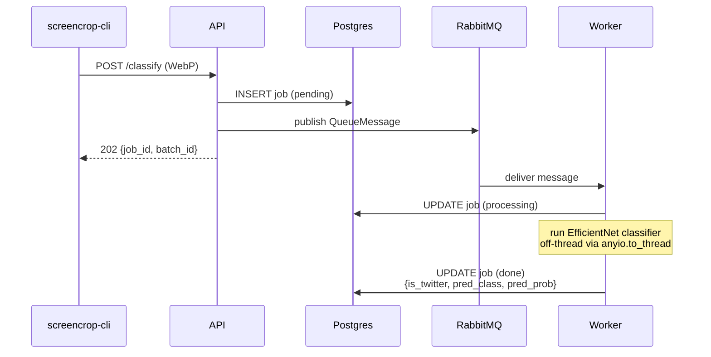
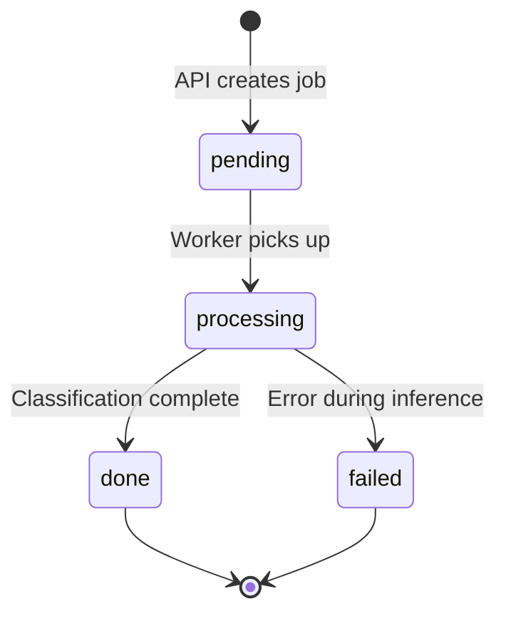

# Running the classifier service end to end

This is the deep guide to the screenshot ingest/classify service: bring up every
supporting service, start the API and worker two different ways, submit real
folders of screenshots, monitor them live with `top`/`status`/`doctor`, and
export the twitter-positive results into the training dataset.

If you just want the fastest path from clone to export, use
[quickstart.md](quickstart.md) (about ten minutes) instead. For the endpoint
list, full config table, and export semantics, see
[screencrop-pipeline.md](screencrop-pipeline.md). This guide goes deeper on the
newer `serve`, `top`, and `doctor` commands and on monitoring the stack while
it's running.

## What you'll build

A local-only system, no cloud dependencies. The CLI compresses each screenshot
to a lossless WebP and uploads it to a FastAPI service (torch-free, runs on
`127.0.0.1:8000`). The API writes a `pending` job row to Postgres and publishes
a small JSON message to RabbitMQ, returning HTTP `202` immediately. A
**separate** worker process consumes the queue, runs the classifier
(EfficientNet-B0, `ScreenNetV1.pth`) off the event loop, and writes
`done`/`failed` back to Postgres. Postgres is the source of truth; Prometheus
and Grafana provide advisory live metrics on top of it.

Classes are `[facebook, tiktok, twitter]`; `is_twitter = (pred_class ==
"twitter")`.



## Prerequisites

| Requirement | Notes |
| --- | --- |
| [uv](https://docs.astral.sh/uv/) | Dependency manager — this project never uses `pip`/`poetry` directly. See [installation.md](installation.md). |
| Docker Desktop, running | Postgres, RabbitMQ, Prometheus, and Grafana all come from `docker-compose.yml`. |
| Python 3.11–3.13 | `uv` fetches a matching interpreter if you don't have one. |
| `fzf` binary | Only needed for `serve --select`/`--fuzzy` (and `demo --select`). Install with `brew install fzf`. |

## Step 1 — Install and fetch weights

```bash
git clone https://github.com/bossjones/screencropnet_yolov11.git
cd screencropnet_yolov11
make install            # uv sync --all-extras (includes the opt-in worker deps)
make download-weights   # fetch ScreenNetV1.pth into scratch/models/
```

`make install` uses `--all-extras`, so the classifier deps (`torch`,
`torchvision`) — normally an opt-in `worker` group so the API and test suite
stay lean — are already included.

`make download-weights` is idempotent, creates parent directories as needed,
and rejects HTML error pages instead of saving them as a fake checkpoint.
Override the destination with `SCREENCROPNET_WEIGHTS_PATH`, and force a
re-download with `ARGS=--force`:

```bash
SCREENCROPNET_WEIGHTS_PATH=~/models/ScreenNetV1.pth make download-weights
make download-weights ARGS=--force
```

## Step 2 — Bring up services and schema

```bash
make services-up   # docker compose up -d: postgres, rabbitmq, prometheus, grafana
make migrate        # uv run alembic upgrade head — creates classification_jobs
```

`make services-up` runs a Docker preflight first, so a stopped daemon prints an
actionable message instead of a raw socket error.

| Service | Host URL / port |
| --- | --- |
| postgres | `localhost:5432` |
| rabbitmq (AMQP) | `localhost:5672` |
| rabbitmq management UI | <http://localhost:15672> (`guest`/`guest`) |
| prometheus | <http://localhost:9091> (host `9091` → container `9090`) |
| grafana | <http://localhost:3001> (anonymous admin, no login) |
| FastAPI (started in Step 3) | <http://127.0.0.1:8000> (metrics at `/metrics/`) |
| worker metrics (started in Step 3) | <http://127.0.0.1:8001/> |

∆ If you don't need to run each step by hand, `make stack-up` does
`services-up` + wait-for-healthy + `download-weights` + `migrate` in one shot,
then leaves the stack running and tells you to start `make api` and `make
worker` yourself in separate terminals — which is exactly Step 3 below.

## Step 3 — Start the API and worker

The HTTP layer is torch-free; only the worker loads the model. Pick one of the
two options below.

### Option A — Two processes (`make api` + `make worker`)

The explicit way — one terminal per process, using whatever weights
`SCREENCROPNET_WEIGHTS_PATH` currently points at (default
`scratch/models/ScreenNetV1.pth`, set in Step 1).

```bash
# terminal A
make api      # uv run uvicorn screencropnet_yolo.server.api:create_app --factory --host 127.0.0.1 --port 8000

# terminal B
make worker   # uv run screencrop-worker (needs worker deps + weights)
```

Use this when you already know which weights you want, when you're scripting
CI/automation, or when you want the two processes' logs in separate terminals
you control directly.

### Option B — One command with `serve`

```bash
uv run screencrop-cli serve --select --with-worker
# equivalently: make serve SELECT=1 WITH_WORKER=1
```

`serve` resolves a weights file — with `--select`/`--fuzzy` it fuzzy-picks a
`.pt`/`.onnx`/`.pth` file from `settings.model_search_roots` (`runs/` and
`scratch/models/`, newest-first) via `fzf`; ESC aborts the launch. It then
exports the chosen path as `SCREENCROPNET_WEIGHTS_PATH` (clearing the cached
`Settings` singleton so the change takes effect), optionally launches a
detached worker in that same env with `--with-worker`, and finally runs
uvicorn.

```bash
uv run screencrop-cli serve                        # use the configured weights
uv run screencrop-cli serve --host 0.0.0.0 --port 9000
```

Use this when you want to interactively pick between multiple trained
checkpoints under `runs/` or `scratch/models/` without hand-editing an env var,
or as a one-command alternative to Option A. It requires `fzf` only when you
pass `--select`/`--fuzzy`; plain `serve` never needs it. See
[serve.md](serve.md) for the full flag reference.

## Step 4 — Submit a folder of screenshots

```bash
uv run screencrop-cli submit ./some_folder
```

`submit` is **fire-and-forget**: it spawns a detached uploader process and
prints a `batch_id` immediately — it does not block until every image is
uploaded. Because every job's progress lives in Postgres, killing the CLI never
loses state; you can resume monitoring the same `batch_id` later.

The uploader recursively discovers `.png`/`.jpg`/`.jpeg`/`.webp`/`.bmp`/`.gif`/`.tiff`
files, compresses each to a lossless WebP, and `POST`s it to `/classify` with
concurrency bounded by `SCREENCROPNET_CLIENT_CONCURRENCY` (default `8`).

```bash
uv run screencrop-cli submit ./some_folder --batch-id my-run-1
uv run screencrop-cli submit ./some_folder --recursive      # default; walk subfolders
uv run screencrop-cli submit ./some_folder --no-recursive   # top-level files only
```

| Flag | Meaning |
| --- | --- |
| `--batch-id TEXT` | Tag every job in this submission with a batch id (auto-generated if omitted). |
| `--recursive` / `--no-recursive` | Whether to walk subdirectories (default: recursive). |



## Step 5 — Monitor jobs



Every job moves through `pending` → `processing` → `done`|`failed` in the
`classification_jobs` table. You have four ways to watch that happen.

### `top` — live dashboard

```bash
uv run screencrop-cli top                       # refresh every 5s, all batches
uv run screencrop-cli top --refresh 2 --batch-id <batch_id>
make top REFRESH=5 BATCH=<batch_id>              # same, via make
```

| Flag | Meaning |
| --- | --- |
| `--batch-id TEXT` | Scope the dashboard to one batch. |
| `--refresh FLOAT` | Redraw interval in seconds (default `5.0`). |

| Key | Action |
| --- | --- |
| `r` | Refresh now |
| `q` | Quit |

Each refresh pulls `/status` and `/jobs` concurrently and redraws a summary
line (batch, total, twitter-positive count, throughput/s, per-status
breakdown) plus a job table (short id, status, twitter flag, predicted class,
original path); older rows beyond the display cap collapse to `(+N more)`. If
the API is unreachable, `top` shows a red "server unreachable" banner and keeps
retrying on the same interval instead of crashing. See [top.md](top.md).

### `status --watch` — lightweight polling

```bash
uv run screencrop-cli status --batch-id <batch_id> --watch
```

Refreshes until every job in the batch is `done` or `failed`, then exits — a
good fit for scripts and CI where a full TUI is overkill.

### `doctor` — health-check the whole stack

```bash
uv run screencrop-cli doctor          # rich table of ✔︎/✘ + latency
uv run screencrop-cli doctor --json   # machine-readable JSON
make doctor                            # same as the plain command
```

`doctor` probes all six components concurrently (`asyncio.gather`), each with a
per-probe timeout (`SCREENCROPNET_DOCTOR_TIMEOUT`, default `2.0`s):

| Service | Probe |
| --- | --- |
| postgres | async `SELECT 1` |
| rabbitmq | open + close an AMQP connection |
| api | `GET /healthz`, expecting `{"ok": true}` |
| worker | `GET` the worker metrics port |
| prometheus | `GET /-/healthy` |
| grafana | `GET /api/health` |

It exits `0` only when **every** check passes, `1` if any fails or times out —
so it drops straight into CI or a shell `&&` chain:

```bash
uv run screencrop-cli doctor && uv run screencrop-cli submit ./shots
```

See [doctor.md](doctor.md) for the full probe/target table.

### Metrics in Grafana & Prometheus

The API (`/metrics/`) and the worker (`:8001/`) each expose Prometheus
metrics:

- `screencrop_jobs_submitted_total`
- `screencrop_jobs_processed_total{status}`
- `screencrop_twitter_positive_total`
- `screencrop_jobs_in_progress`
- `screencrop_jobs_by_status{status}`
- `screencrop_pred_latency_seconds`

The provisioned Grafana dashboard **"ScreenCrop ingest/classify"** plots
jobs-by-status, twitter-positive total, processed rate, and prediction-latency
p95.

```bash
make open-grafana      # http://localhost:3001
make open-prometheus   # http://localhost:9091
make open-rabbitmq     # http://localhost:15672 (guest/guest)
make logs-api          # tail logs/api.log
make logs-worker       # tail logs/worker.log
```

## Step 6 — Inspect and export results

```bash
uv run screencrop-cli twitter --batch-id <batch_id>   # twitter-positive results
uv run screencrop-cli results --batch-id <batch_id>   # processing results for jobs
```

Always preview an export before running it for real:

```bash
uv run screencrop-cli export --batch-id <batch_id> --dry-run
uv run screencrop-cli export --batch-id <batch_id>
```

`export` copies the **real original** twitter-positive files — never the
`/tmp` WebP — into the raw dataset (`SCREENCROPNET_RAW_DATASET_DIR`, default
`scratch/datasets/twitter_screenshots_raw/train_images`) as
`NNNNN_twitter.EXT`, continuing the numbering from the current max index.
It's idempotent (a `.export_manifest.json` sidecar records what was already
copied) and collision-safe — it probes for the next free index rather than
overwriting.

## Optional — Profiling

Set `SCREENCROPNET_PROFILE` (to any value) to enable per-request flamegraphs:
any request carrying `?profile=1` then returns a pyinstrument HTML flamegraph
instead of its normal body. It's off by default, so production and tests are
unaffected.

```bash
SCREENCROPNET_PROFILE=1 make api
curl "http://127.0.0.1:8000/healthz?profile=1" -o healthz_profile.html
```

For CLI/module profiling:

```bash
make profile-demo     # profile a demo inference run -> profile_demo.html
make profile-doctor   # profile a doctor sweep -> profile_doctor.html
make profile RUN="-m pkg.mod args" OUT=profile.html
make profile-open     # open the most recent profiling HTML report
```

## Tear down

```bash
make services-down   # docker compose down
```

Stop the `api`/`worker` processes (or the `serve --with-worker` process) with
`Ctrl-C` in their terminals first.

## Troubleshooting

| Symptom | Fix |
| --- | --- |
| `make services-up` / `make stack-up` complains the Docker daemon is down | Start Docker Desktop, then retry. |
| `make worker` (or `serve --with-worker`) fails to load the model | Run `make download-weights`; confirm `scratch/models/ScreenNetV1.pth` exists or that `SCREENCROPNET_WEIGHTS_PATH` points at a valid checkpoint. |
| Port 8000 (API) already in use | Set `SCREENCROPNET_API_PORT` to a free port before `make api` / `serve`. |
| Worker metrics port 8001 already in use | Set `SCREENCROPNET_WORKER_METRICS_PORT` before `make worker`. |
| `serve --select` errors that `fzf` isn't found | `brew install fzf`; plain `serve` (no `--select`) never needs it. |
| `doctor` shows a service as `✘` | Check that specific service — `postgres`/`rabbitmq` come from `make services-up`, `prometheus`/`grafana` too, `api`/`worker` are the host processes from Step 3. |

## Where to go next

- [quickstart.md](quickstart.md) — the 10-minute fast path through the same
  pipeline.
- [screencrop-pipeline.md](screencrop-pipeline.md) — architecture reference:
  endpoints, the full `SCREENCROPNET_` config table, export semantics, and
  tests.
- [serve.md](serve.md) — full `serve` flag reference and fuzzy-selection
  details.
- [top.md](top.md) — full `top` reference, including the pure `build_snapshot`
  data layer.
- [doctor.md](doctor.md) — full `doctor` reference and exit-code semantics.
- [demo.md](demo.md) — `screencrop-demo`, the YOLO detector smoke test (a
  different pipeline from this classify service).
