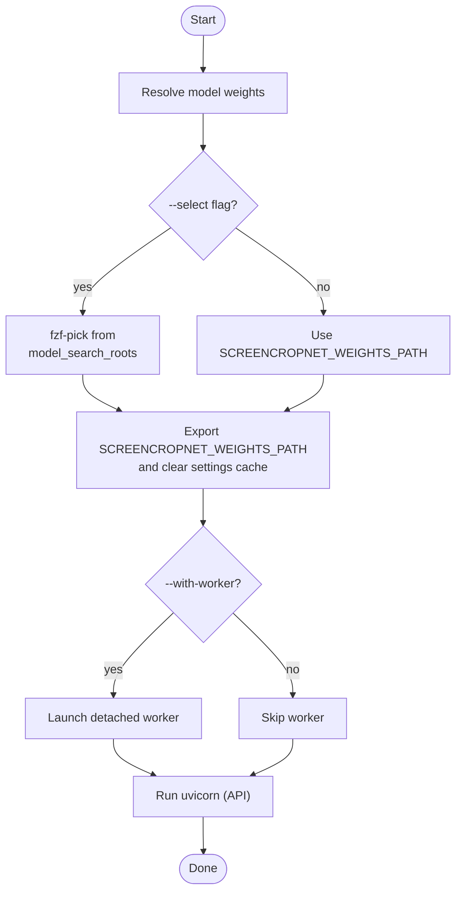

# `screencrop-cli serve`

Boot the FastAPI ingest/classify service, optionally fuzzy-picking the model
weights first. The API itself only enqueues; the **worker** loads the ScreenNet
weights from `settings.weights_path`. So `serve` resolves a weights file, exports
it as `SCREENCROPNET_WEIGHTS_PATH`, and then launches uvicorn — so a worker
started with `--with-worker` (or `make worker` in the same shell) loads the same
model.

```bash
uv run screencrop-cli serve                       # use the configured weights
uv run screencrop-cli serve --select              # fzf-pick weights, then serve
uv run screencrop-cli serve --fuzzy --with-worker # alias for --select; also start a worker
uv run screencrop-cli serve --host 0.0.0.0 --port 9000
make serve SELECT=1 WITH_WORKER=1                 # same, via make
```

## Options

| Flag             | Meaning                                                                 |
| ---------------- | ----------------------------------------------------------------------- |
| `--select`/`--fuzzy` | Interactively pick a `.pt`/`.onnx`/`.pth` file via `fzf`.            |
| `--with-worker`  | Spawn a detached `screencrop-worker` in the same (weights-exported) env. |
| `--host`         | Bind host (default `settings.api_host`, `127.0.0.1`).                    |
| `--port`         | Bind port (default `settings.api_port`, `8000`).                         |

## What `serve` does



## Fuzzy selection

`--select` reuses the same picker as the `demo` CLI (see [demo.md](demo.md)),
searching `settings.model_search_roots` (default `runs/` and `scratch/models/`)
and adding `.pth` to the extensions so ScreenNet classifier weights are listed
alongside YOLO `.pt`/`.onnx` files. Candidates are shown newest-first. Cancelling
the picker (ESC) aborts the launch.

> `fzf` is a system prerequisite for `--select` (`brew install fzf`). It is
> imported lazily, so every other path — including plain `serve` — runs without
> it.

## Notes

- `get_settings()` is `@lru_cache`d; `serve` clears that cache after exporting
  the weights env var so the new path takes effect.
- Weights resolution (`resolve_serve_weights`) is pure and unit-tested; the
  uvicorn/worker launch is thin and patched in tests.

For the full stack bring-up in context, see
[running-the-classifier-service.md](running-the-classifier-service.md).
