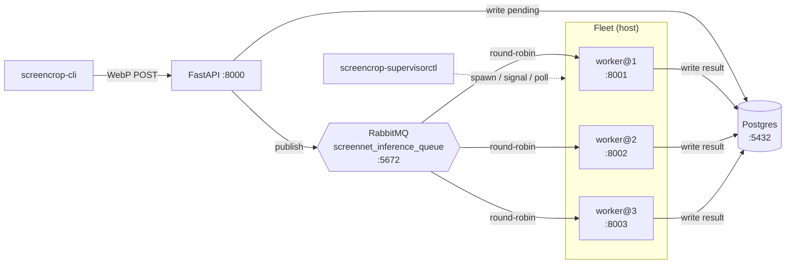

# `screencrop-supervisorctl`

Operate a **fleet of host `screencrop-worker` processes**. Workers are competing
consumers on one shared durable RabbitMQ queue (`screennet_inference_queue`), so
running N of them already gives "an idle worker grabs the next job". Workers must
run on the host (they need MPS/CUDA), so `docker-compose` — which runs infra only
— cannot scale them; this command is the host-side manager.

`screencrop-supervisorctl` is an alias of `screencrop-supervisor-worker`; both
resolve to the same Typer app.

```bash
uv run screencrop-supervisorctl start -w 3        # spawn 3 detached workers
uv run screencrop-supervisorctl start --fuzzy     # fzf-pick weights, then spawn
uv run screencrop-supervisorctl status            # PID-liveness table
uv run screencrop-supervisorctl status --json --probe
uv run screencrop-supervisorctl logs worker@1 -f --color
uv run screencrop-supervisorctl restart --all
uv run screencrop-supervisorctl stop --all        # warm, then cold-kill stragglers
```

## Fleet topology

`supervisorctl` spawns N detached `screencrop-worker` processes that all consume
the one shared queue as competing consumers; each worker gets its own metrics
port, log, and state file (see below). The API only enqueues — Postgres is the
source of truth.



For the warm-shutdown handshake and fleet/job lifecycle diagrams, see
[worker-fleet-architecture.md](worker-fleet-architecture.md); for a hands-on
walkthrough, see [worker-fleet-tutorial.md](worker-fleet-tutorial.md).

## Commands

| Command | Purpose |
| ------- | ------- |
| `start -w N [--select/--fuzzy] [--model P] [--prefetch K] [--metrics-base-port B]` | Resolve a model, spawn N detached workers (each with its own metrics port + log + state file). |
| `stop [NAME \| --all] [--timeout S] [--cold]` | Warm shutdown (SIGTERM, drain in-flight up to `--timeout`) then cold-kill (SIGKILL); clears state. `--cold` skips the grace period. |
| `restart [NAME \| --all] [--timeout S]` | Reconstruct the fleet from persisted state: stop it, then re-spawn the same count + weights. |
| `status [--json] [--probe]` | Per-worker PID liveness + metadata (name/pid/port/uptime/weights). `--probe` adds metrics-port reachability. |
| `logs NAME [-f/--follow] [-n N] [--color/--plain]` | Tail a worker's log via `tail` (piped to `less -R` when `--color`). |

## Competing-consumer model

All workers `basic.consume` from the same durable queue with a shared prefetch,
so RabbitMQ round-robins jobs to whichever worker is free. There is no routing to
a "specific" worker — the fleet is a pool of interchangeable consumers. That is
why `restart` reconstructs the whole fleet rather than a single named worker.

## Warm vs cold shutdown

`stop` first sends **SIGTERM** to every worker. Each worker installs a SIGTERM
handler that cancels its RabbitMQ consumer (so no new jobs arrive), waits for
in-flight `on_message` handlers to drain (bounded by the worker's own timeout),
then closes the connection. The supervisor polls liveness for up to `--timeout`
seconds; any worker still alive afterward is **SIGKILL**ed. `--cold` sets the
grace period to zero.

Without this, a bare `SIGTERM` would drop in-flight jobs — the warm path lets the
current classification finish and be acked (or, if it overruns, its message stays
unacked and the broker requeues it for another worker).

## Fuzzy model selection

`--select`/`--fuzzy` reuses the same picker as `serve` and `demo` (see
[serve.md](serve.md)), searching `settings.model_search_roots` (default `runs/`
and `scratch/models/`) for `.pt`/`.onnx`/`.pth` weights, newest-first. The chosen
path is exported as `SCREENCROPNET_WEIGHTS_PATH` and propagated to **every** worker
in the fleet, so they all load the same model. `--model P` bypasses the picker
with an explicit path.

> `fzf` is a system prerequisite for `--select` (`brew install fzf`). It is
> imported lazily, so every other path runs without it. `tail`/`less` (for `logs`)
> are standard system tools.

## Per-worker ports, logs, and state

Each worker `i` (1-based) gets:

- **metrics port** `supervisor_metrics_base_port + (i-1)` — the key collision
  gotcha: distinct ports let Prometheus scrape every worker.
- **log file** `logs/supervisor/worker-<i>.log` (via `SCREENCROPNET_WORKER_LOG_PATH`).
- **state file** `logs/supervisor/worker-<i>.json` — the PID/port/weights record
  that `status`/`stop`/`restart` read (written crash-safely via
  `strif.atomic_output_file`).

`status` liveness is plain **PID liveness** (`kill(pid, 0)`) — no per-worker HTTP
probing by default; metrics are left to Prometheus/Grafana and `doctor`. Pass
`--probe` to additionally check each worker's metrics port via `doctor.check_http`.

## Environment overrides

All fields come from `Settings` (`SCREENCROPNET_` prefix):

| Setting | Env var | Default |
| ------- | ------- | ------- |
| `supervisor_workers` | `SCREENCROPNET_SUPERVISOR_WORKERS` | `2` |
| `supervisor_metrics_base_port` | `SCREENCROPNET_SUPERVISOR_METRICS_BASE_PORT` | `8001` |
| `supervisor_state_dir` | `SCREENCROPNET_SUPERVISOR_STATE_DIR` | `logs/supervisor` |
| `worker_log_path` | `SCREENCROPNET_WORKER_LOG_PATH` | `None` (shared `logs/worker.log`) |

## Why not Celery

Celery was considered and rejected: its task bodies are synchronous (prefork),
but our worker + DB layer are async (`aio-pika`, asyncpg); Postgres already is the
job-status source of truth (Celery would add a second one); and prefork + CUDA/MPS
is a classic fork footgun. Monitoring is already covered by Prometheus/Grafana and
`doctor`. See `specs/screencrop-supervisorctl.md` for the full rationale.
