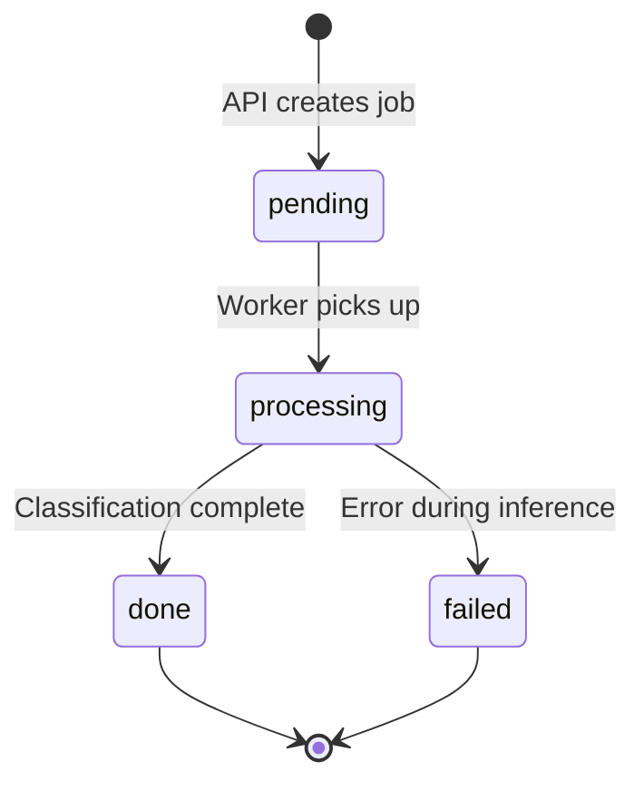

# `screencrop-cli top`

A live [Textual](https://textual.textualize.io/) dashboard of jobs in flight. It
polls the API on an interval and redraws a summary line plus a job table — a
richer, interactive alternative to `status --watch`.

```bash
uv run screencrop-cli top                       # refresh every 5s, all batches
uv run screencrop-cli top --refresh 2           # refresh every 2 seconds
uv run screencrop-cli top --batch-id <batch>    # scope to one batch
make top REFRESH=2 BATCH=<batch>                # same, via make
```

## Keys

| Key | Action              |
| --- | ------------------- |
| `r` | Refresh now         |
| `q` | Quit                |

Each row's `status` column tracks where a job sits in its lifecycle:



## What it shows

- **Summary**: batch, total jobs, twitter-positive count, throughput/s, and a
  per-status breakdown (`pending`, `processing`, `done`, `failed`).
- **Job table**: the most recent jobs (short id, status, twitter flag,
  predicted class, original path). Older rows beyond the cap are summarized as
  `(+N more)`.

## Resilience

Each refresh pulls `/status` and `/jobs` concurrently. If the API is down, the
dashboard shows a red `server unreachable` banner and keeps retrying on the same
interval — it never crashes out of the loop.

## Implementation note

The data layer (`build_snapshot` → `TopSnapshot` in
`screencropnet_yolo.client.tui`) is pure and unit-tested without a terminal; the
`TopApp` shell only wires it to widgets and a `set_interval` timer.

For the full stack bring-up in context, see
[running-the-classifier-service.md](running-the-classifier-service.md).
