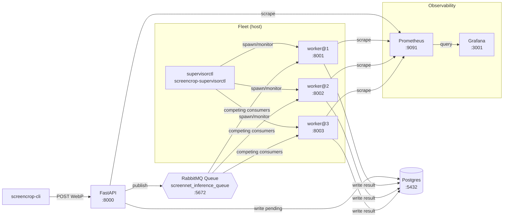
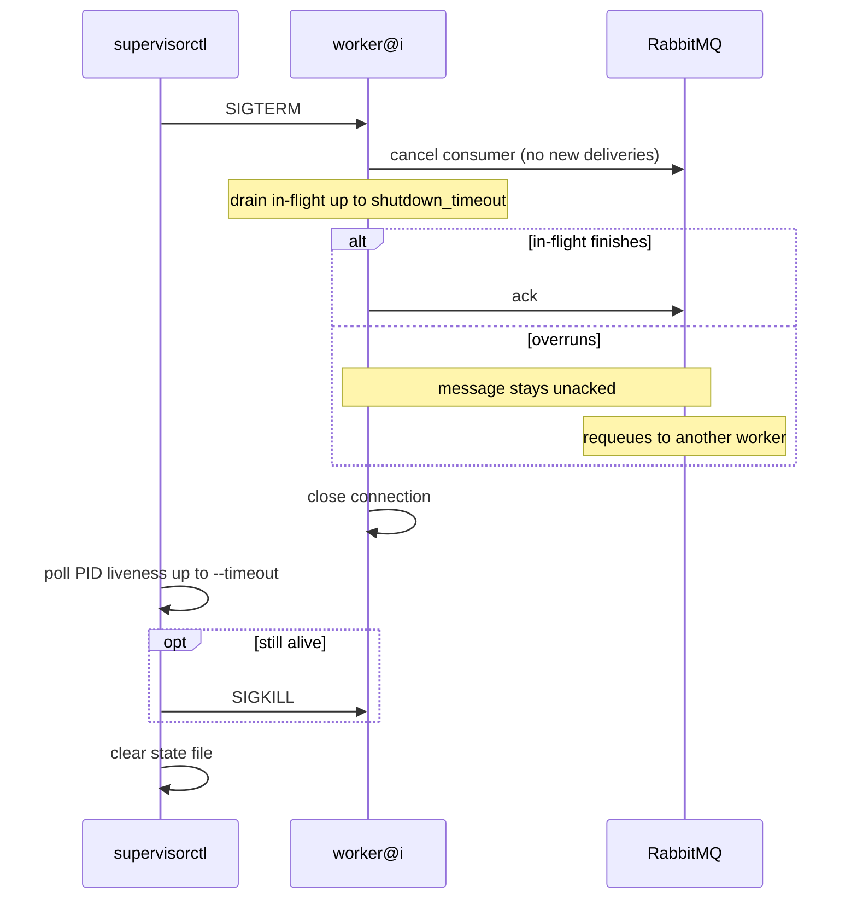
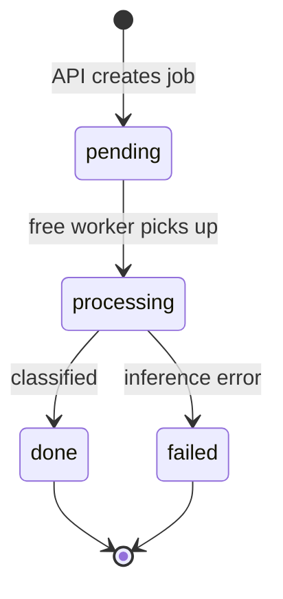

# Worker fleet architecture

The worker fleet is a pool of detached host processes that compete to consume
classification jobs from a durable RabbitMQ queue. The `screencrop-supervisorctl`
CLI spawns and monitors these workers, assigns each a unique metrics port and log
path, and coordinates warm shutdown by draining in-flight work before exit. Jobs
move through Postgres from `pending` (API-created) → `processing` (worker-claimed)
→ `done` or `failed`, while metrics flow to Prometheus and Grafana.

## Fleet topology

The CLI posts compressed screenshots to a stateless FastAPI service, which writes
jobs to Postgres and publishes them to the shared queue. Workers operate as
competing consumers — RabbitMQ round-robins deliveries to whichever is free. All
components emit metrics that Prometheus scrapes and Grafana visualizes.

## Warm-shutdown handshake

When `stop` or `restart` is invoked, the supervisor sends SIGTERM to each worker.
The worker immediately cancels its RabbitMQ consumer to block new deliveries, then
drains in-flight handlers up to `shutdown_timeout` (default 30s). Messages that
finish are acknowledged; overruns stay unacked and are requeued by RabbitMQ to
another free worker (at-least-once delivery). Once drained, the worker closes the
connection. The supervisor polls PID liveness and SIGKILLs any straggler, then
clears the state file.

## Fleet lifecycle

The fleet transitions through five states. `starting` spawns N detached worker
processes and writes their metadata to state files. `running` is the steady state;
the supervisor monitors PID liveness. `draining` is entered when `stop` or
`restart` sends SIGTERM; workers drain and exit. Once all have exited or been
force-killed and state is cleared, the fleet reaches `stopped`. From `stopped`,
`restart` reads persisted state and reconstructs the fleet in `starting` again.

```mermaid
stateDiagram-v2
    [*] --> starting: start -w N
    starting --> running: N detached workers,<br/>state written
    running --> draining: stop/restart:<br/>SIGTERM
    draining --> stopped: drained or<br/>SIGKILLed;<br/>state cleared
    stopped --> starting: restart reconstructs<br/>from state
    stopped --> [*]
```

## Job lifecycle

Each job in the `classification_jobs` table follows a linear path. The API creates
it in `pending` state. A free worker claims it (moving it to `processing`) and runs
inference off the event loop. On success the job moves to `done`; on inference
error, to `failed`. Both terminal states allow the job to be reaped or archived.

## See also

- [supervisor.md](supervisor.md) — CLI reference for `screencrop-supervisorctl`
  (start, stop, restart, status, logs).
- [worker-fleet-tutorial.md](worker-fleet-tutorial.md) — hands-on walkthrough:
  spawning a fleet, consuming the queue, observing metrics.
- [screencrop-pipeline.md](screencrop-pipeline.md) — API endpoints, Prometheus
  metric registry, and configuration reference.
