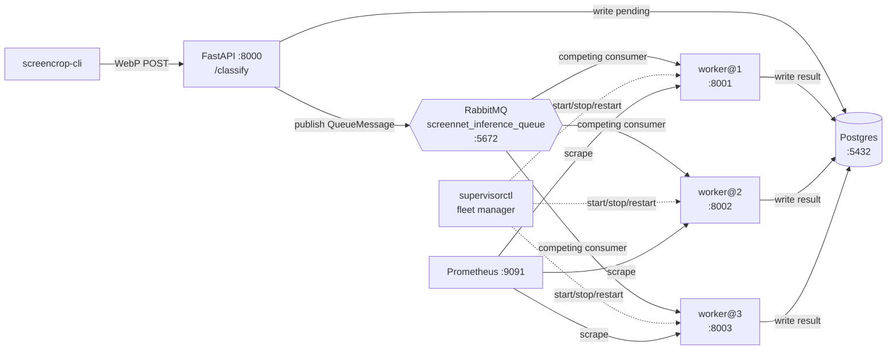
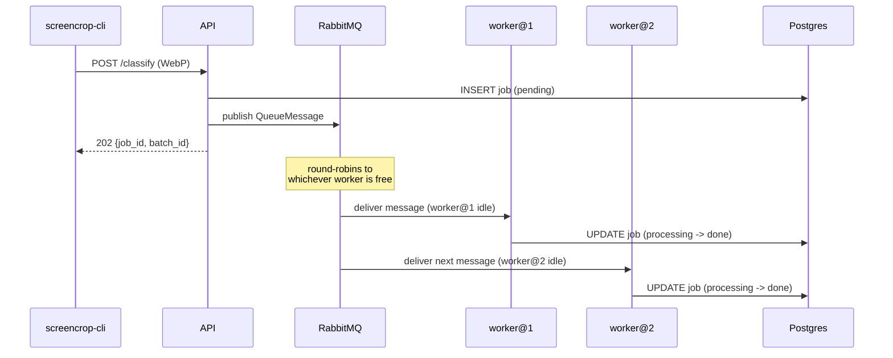
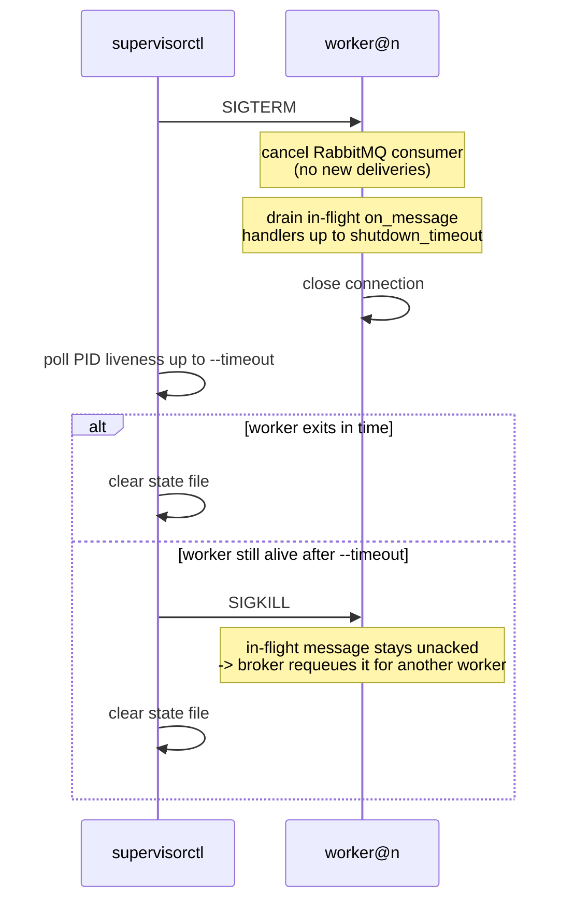
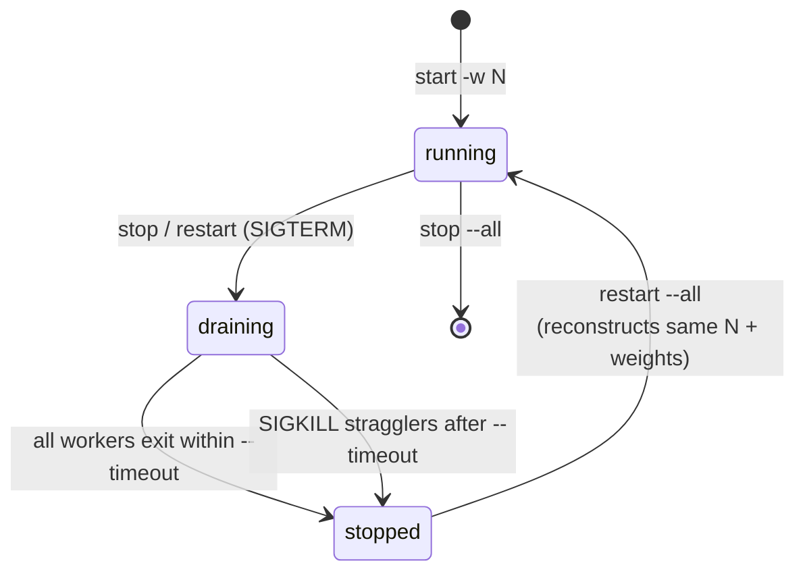

# Scaling to a worker fleet

The [single-worker guide](running-the-classifier-service.md) gets you one
`screencrop-worker` process consuming the classify queue — fine for a laptop
run against a few dozen screenshots. Point the same CLI at a folder of ten
thousand images and one worker becomes the bottleneck: RabbitMQ happily queues
everything, but only one process is ever pulling jobs off it. Workers must run
on the host (they need MPS/CUDA — Docker only hosts the infra), so you can't
just add a `replicas:` line to `docker-compose.yml`.

This tutorial walks you from a clean clone to a **fleet of three competing
workers**, all consuming the same durable queue, managed as a unit by
`screencrop-supervisorctl`. You'll start the fleet, submit a real folder,
watch RabbitMQ round-robin jobs across workers, warm-restart the fleet without
losing in-flight work, and scale it up or down. By the end you'll understand
why the fleet has no concept of "worker 2 handles image X" — it's a pool of
interchangeable consumers, not a sharded system.

## What you'll build

A local-only system: `screencrop-cli` uploads to a single FastAPI endpoint,
which fans work out over one shared queue to however many workers you've
started.



## Prerequisites

| Requirement | Notes |
| --- | --- |
| [uv](https://docs.astral.sh/uv/) | Dependency manager — this project never uses `pip`/`poetry` directly. See [installation.md](installation.md). |
| Docker Desktop, running | Postgres, RabbitMQ, Prometheus, and Grafana all come from `docker-compose.yml`. |
| Python 3.11–3.13 | `uv` fetches a matching interpreter if you don't have one. |
| `fzf` binary | Only needed for `start --select`/`--fuzzy`. Install with `brew install fzf`. |

> `fzf` is a system prerequisite, not a Python dependency — it's a separate
> binary the CLI shells out to. Every other fleet command runs fine without it.

## Step 1 — Install and fetch weights

```bash
git clone https://github.com/bossjones/screencropnet_yolov11.git
cd screencropnet_yolov11
make install            # uv sync --all-extras (includes the opt-in worker deps)
make download-weights   # fetch ScreenNetV1.pth into scratch/models/
```

`make install` uses `--all-extras`, so the classifier deps (`torch`,
`torchvision`) are already included. `make download-weights` is idempotent and
creates parent directories as needed. All three fleet workers will load this
same checkpoint.

## Step 2 — Bring up services and schema

```bash
make services-up   # docker compose up -d: postgres, rabbitmq, prometheus, grafana
make migrate        # uv run alembic upgrade head
```

`make services-up` runs a Docker preflight first, so a stopped daemon prints
an actionable message instead of a raw socket error.

## Step 3 — Start the API

The fleet still needs exactly one HTTP layer in front of it — every worker,
however many you run, consumes from the same queue that this one API process
feeds.

```bash
uv run screencrop-cli serve
```

`serve` here is deliberately plain — no `--with-worker` — because in this
tutorial the workers are managed separately, by the fleet supervisor in the
next step. See [serve.md](serve.md) for the full flag reference and the
two-process option if you only need a single worker.

## Step 4 — Start the fleet

```bash
uv run screencrop-supervisorctl start -w 3 --fuzzy
```

`start -w 3` resolves one model (here interactively, via `fzf`), then spawns
three detached `screencrop-worker` processes. `screencrop-supervisorctl` is a
Typer CLI; `screencrop-supervisor-worker` is an exact alias for the same app.

Each worker gets its own metrics port, log file, and state file, but they all
load the **same** weights — the one path resolved above, exported as
`SCREENCROPNET_WEIGHTS_PATH` and propagated to every worker. Worker `i` is
0-based internally but named `worker@n` with `n = i+1`:

| Worker | Metrics port | Log | State |
| --- | --- | --- | --- |
| `worker@1` | `8001` | `logs/supervisor/worker-1.log` | `logs/supervisor/worker-1.json` |
| `worker@2` | `8002` | `logs/supervisor/worker-2.log` | `logs/supervisor/worker-2.json` |
| `worker@3` | `8003` | `logs/supervisor/worker-3.log` | `logs/supervisor/worker-3.json` |

The metrics port is `base_metrics_port + i` (default base `8001`, from
`SCREENCROPNET_SUPERVISOR_METRICS_BASE_PORT`) — distinct ports so Prometheus
can scrape each worker individually. The state file is the crash-safe JSON
record (PID, port, weights) that `status`/`stop`/`restart` read back.

None of the three workers are addressable individually from the queue's point
of view — they're **competing consumers**. RabbitMQ hands each job to
whichever worker is currently free:



If you want a single co-launched worker instead of a managed fleet, see the
two-process and `serve --with-worker` options in
[running-the-classifier-service.md](running-the-classifier-service.md).

## Step 5 — Submit a folder of images

```bash
uv run screencrop-cli submit ./some_folder
```

`submit` is **fire-and-forget**: it spawns a detached uploader and prints a
`batch_id` immediately, whether you have one worker or thirty. The uploader
recursively discovers `.png`/`.jpg`/`.jpeg`/`.webp`/`.bmp`/`.gif`/`.tiff`
files, compresses each to a lossless WebP, and `POST`s it to `/classify` with
concurrency bounded by `SCREENCROPNET_CLIENT_CONCURRENCY` (default `8`).
Recursive discovery is the default.

```bash
uv run screencrop-cli submit ./some_folder --batch-id fleet-run-1
uv run screencrop-cli submit ./some_folder --no-recursive   # top-level files only
```

## Step 6 — Monitor the fleet

`screencrop-supervisorctl status` answers "which workers are alive and where"
— it's PID liveness, not job progress:

```bash
uv run screencrop-supervisorctl status
uv run screencrop-supervisorctl status --json --probe
```

`--probe` additionally checks each worker's metrics port is reachable, on top
of the default `os.kill(pid, 0)` liveness check.

For job-level progress across the fleet — pending/processing/done/failed
counts, throughput, twitter-positive count — use the same tools as the
single-worker path, since they read from Postgres and don't care how many
workers are writing to it:

```bash
uv run screencrop-cli top --refresh 2 --batch-id fleet-run-1
uv run screencrop-cli doctor
```

`doctor` probes postgres/rabbitmq/api/worker/prometheus/grafana concurrently
and exits `0` only if every check passes — a good fleet-wide sanity check
before you submit a large batch. See [top.md](top.md) and
[doctor.md](doctor.md) for the full reference on each command; see
[running-the-classifier-service.md](running-the-classifier-service.md) for the
full monitoring walkthrough (including `status --watch` and Grafana).

## Step 7 — Warm restart and scale

Restarting reconstructs the **whole fleet** from persisted state — same
worker count, same weights — rather than touching one named worker, because
individual workers aren't independently addressable consumers:

```bash
uv run screencrop-supervisorctl restart --all
```

Under the hood, restart (and plain `stop`) is a warm handshake, not a bare
kill:



That drain window is why scaling down is safe even mid-batch: any job a
stopped worker hadn't finished acking gets requeued and picked up by one of
the survivors.



To scale the fleet up or down, stop it and start it again at the new size —
there's no in-place "add one more worker":

```bash
uv run screencrop-supervisorctl stop --all             # warm, then cold-kill stragglers
uv run screencrop-supervisorctl start -w 5 --fuzzy      # same weights, more consumers
```

Use `--cold` on `stop` to skip the grace period entirely, and `--timeout` to
tune how long in-flight jobs get to finish before a straggler is SIGKILLed.
The full flag reference — including `logs`, per-flag defaults, and the
competing-consumer rationale — lives in [supervisor.md](supervisor.md); this
tutorial won't repeat it.

## Step 8 — Inspect and export results

Results live in Postgres regardless of which worker in the fleet produced
them, so inspection and export are identical to the single-worker path:

```bash
uv run screencrop-cli twitter --batch-id fleet-run-1    # twitter-positive results
uv run screencrop-cli results --batch-id fleet-run-1    # processing results for jobs
```

Always preview an export before running it for real:

```bash
uv run screencrop-cli export --batch-id fleet-run-1 --dry-run
uv run screencrop-cli export --batch-id fleet-run-1
```

`export` copies the **real original** twitter-positive files — never the
compressed WebP — into `scratch/datasets/twitter_screenshots_raw/train_images`
as `NNNNN_twitter.EXT`. It's idempotent and collision-safe, so re-running it
after submitting more batches only copies what's new.

## Tear down

```bash
uv run screencrop-supervisorctl stop --all
make services-down   # docker compose down
```

Stop the `serve` process from Step 3 with `Ctrl-C` in its terminal.

## Troubleshooting

| Symptom | Fix |
| --- | --- |
| `start --select`/`--fuzzy` errors that `fzf` isn't found | `brew install fzf`; `start --model PATH` bypasses the picker entirely. |
| `status` shows a worker as dead right after `start` | The weights load (`torch`/`torchvision`) can take a few seconds; re-run `status` or check `logs/supervisor/worker-<n>.log`. |
| Metrics port already in use for one worker | Change `--metrics-base-port` on `start`, or free the conflicting port before starting the fleet. |
| A job you submitted never seems to finish | Run `uv run screencrop-cli doctor` first — if rabbitmq/postgres/api all pass, tail the specific worker with `uv run screencrop-supervisorctl logs worker@N -f`. |
| `stop --all` seems to hang | It's draining in-flight jobs up to `--timeout` (default `30s`); pass `--cold` to skip the grace period, or a longer `--timeout` if your jobs are slow. |
| `restart --all` starts a different worker count than expected | It reconstructs from persisted state files under `logs/supervisor/`; if you hand-deleted or edited those, `stop --all` then `start -w N` explicitly. |

## Where to go next

- [supervisor.md](supervisor.md) — full `screencrop-supervisorctl` command and
  flag reference.
- [running-the-classifier-service.md](running-the-classifier-service.md) — the
  single-worker deep guide, including the two-process option and full
  monitoring detail (`status --watch`, Grafana/Prometheus metrics, profiling).
- [serve.md](serve.md) — full `serve` flag reference and fuzzy-selection
  details.
- [top.md](top.md) — full `top` reference, including the pure `build_snapshot`
  data layer.
- [doctor.md](doctor.md) — full `doctor` reference and exit-code semantics.
- [quickstart.md](quickstart.md) — the 10-minute single-worker fast path, if
  you haven't run the pipeline before at all.
